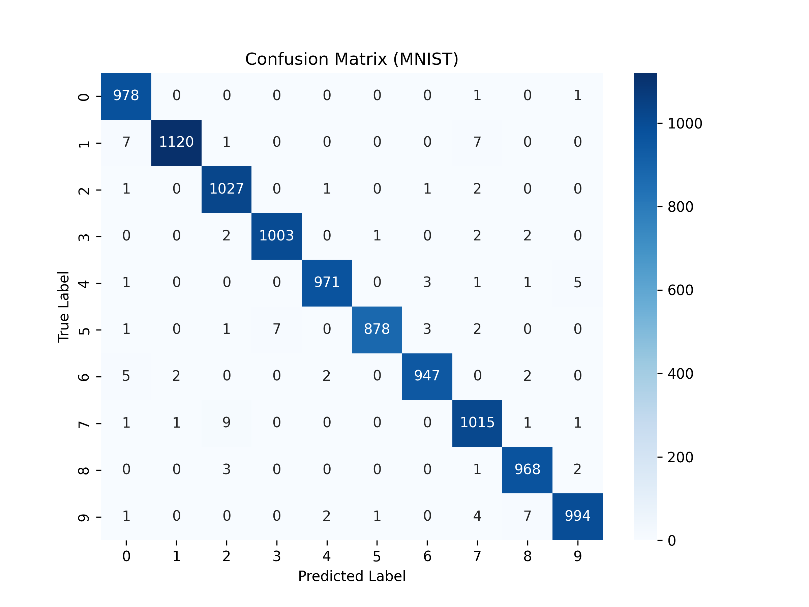

# 手写数字识别实验报告

2025机器学习基础课程大作业 任务一 手写数字识别实验报告

## 一、任务描述

在灰度图像中识别10类手写数字（0-9），属于分类问题

## 二、实验模型原理和概述

卷积神经网络（Convolutional Neural Network, CNN）是一类专门用于处理具有网格结构数据（如图像）的深度学习模型。其核心思想是利用卷积操作自动提取局部特征，通过多层卷积与池化的堆叠逐步抽取更高层次、更加抽象的语义信息，从而完成分类、识别等任务。

### **CNN 的基本组成结构**

一个典型的 CNN 模型通常由如下几类层构成：

#### **（1）卷积层（Convolutional Layer）**

卷积层使用一组可学习的卷积核（filters）对输入图像进行局部感受野计算。每个卷积核负责提取一种局部特征，例如边缘、角点或简单纹理。

卷积层的特点：

- 权值共享：同一个卷积核在图像的不同位置滑动，显著减少模型参数；
- 局部连接：避免全连接网络输入维度过大；
- 可提取空间局部特征。

#### **（2）激活函数（ReLU）**

卷积后通过非线性激活函数 ReLU（Rectified Linear Unit）引入非线性，使模型能够表达更复杂的特征模式。

#### **（3）池化层（Pooling Layer）**

池化层用于降低特征图的空间维度，减少运算量，同时增强特征平移不变性。最常用的是最大池化（Max Pooling），其操作是取局部区域的最大值。池化可以降低分辨率、减少过拟合与保留主要特征信息。

#### **（4）全连接层（Fully Connected Layer）**

在经过多层卷积与池化后，得到的特征图被展平并输入到全连接层，用于整合所有的高级特征并执行分类任务。

### **CNN 在手写数字识别中的优势**

- **无需手工提取特征**，网络可自动学习数字的纹理与形状特点；
- **卷积层共享权重**，使网络参数数量远小于普通全连接网络；
- 对数字位置、形变、部分噪声等具有**良好的鲁棒性**；
- 实际应用中效果优于传统机器学习方法（如 SVM、kNN 等）。

## 三、实验模型结构与参数

本次手写数字识别实验中使用的 CNN 模型结构如下：

1. **Conv1**：输入通道数为 1（灰度图），输出 32 个特征图
2. **Conv2**：将特征维度扩展到 64
3. **Conv3**：进一步提取高维特征，输出 128 个通道
4. **Max Pooling**：每次池化将特征图尺寸缩小一半
5. **Flatten 展平层**：将x展平便于输出全连接层
6. **全连接层 FC1**：128 → 128
7. **输出层 FC2**：128 → 10

该模型通过连续的卷积和池化不断提取局部边缘、纹理、形状、数字轮廓等高级特征，最终通过全连接层输出对应的数字类别。

## 四、实验结果分析

对给出的60000张样例图片集进行训练，每组batch大小为64，epoch设置为5，在10000张的测试集中测试出的正确率为99.01%（9901/10000）。在测试集中数字1被错误识别次数最多，共计15次。

### 训练集收敛曲线

在训练集5个epoch的训练过程中，平均损失在第一个epoch中快速下降，后缓慢下降趋于收敛，最后一个epoch的平均损失仅为**0.019**。

### 测试集结果与失败案例分析

在10000张测试集数据中，有99张错误数据，准确率为99.01%

下图为预测结果的混淆矩阵，记录了预测结果的混淆情况。

其中最高的五项为：

真实 7 → 预测 2 ： 9 次
真实 1 → 预测 0 ： 7 次
真实 1 → 预测 7 ： 7 次
真实 5 → 预测 3 ： 7 次
真实 9 → 预测 8 ： 7 次

以真实值7错误预测2的三张图为例

这三张7的图片均表现出了2的结构特征，其中第三张图交由人眼判断是2或是7仍存在一定的争议。可以从中看出，当图片具有其他数字的特征时，CNN网络很有可能产生错误的论断。而第三张图则表明，在测试集中的确存在部分图像具有争议，神经网络预测结果具有极小而非零的错误率（近似在0.2%左右）是符合预期的。

同时，对与**1**的**总错误数**最高，累计有**15**次。观察错误样例得到，有**7**次将如下**1预测为0**的错误：

即由于1的大部分训练数据样例为竖条形，导致数字 1 本身缺乏便于提取的特征，导致神经网络误将竖条粗细判断为评判是否为1的标准。对于数字形状结构相对清晰的8或0，出现的总错误数就少很多（分别累计6次与2次）。

同时，对于不同字体下形状有显著不同的数字，CNN的预测错误率也会更高，这点数字1同样也可以作为例子。

**上述两图均为数字1，然而结构上却有巨大差别**。这对神经网络的记忆效果有较大的干扰，上图的1在结构上表现出了与数字2相似的特征，而下图的1则仅为一根竖条。如果可以将上下两图的1使用不同的标签标记，那么预测精确度将存在进一步上升的可能。

## 总结

测试集与训练集均为28×28灰度bmp图像，在复杂度上并不高，阿拉伯数字灰度图像本身的特征数也相对有限，对CNN网络的判断干扰较少，网络成功取得了高达99.01%的预测正确率。存在部分数字在扫描过程中的特征丢失，通过人脑的自动补全人可以想象出原本的数字是什么，但对于CNN网络而言要做到这一步仍很困难；同时存在部分数字具有多种形态，对网络的识别产生干扰。

总的来说，手写数字识别对于CNN网络来说是一个相对简单的任务，CNN网络可以以接近100%的正确率完成该项任务，其特征提取与识别优势在该项目中获得了良好发挥。

